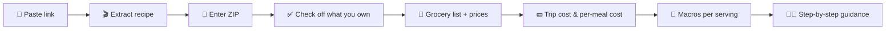

<div align="center">

# 🍞 Breaking Bread

**Turn the cooking video you just watched into a meal you can shop for, afford, and cook.**

Paste a TikTok or Instagram Reel link. Get a grocery list with prices, what the meal costs, macros per serving, and step-by-step guidance written for first-time cooks.


</div>

---

## Why

College students moving into their first apartment tend to overcomplicate cooking. They see a recipe on TikTok, can't tell what it will cost or how hard it is, and end up overspending at the store or ordering in.

Plenty of apps already import recipes from social media, track macros, or estimate cost per meal. Breaking Bread puts **real budgeting** and **beginner-friendly cooking guidance** together in one simple flow, built for people who have never cooked before.

## How it works



1. **Paste a link.** A TikTok works best. Instagram Reels are supported when the platform allows access.
2. **Watch it extract.** Breaking Bread reads the caption first. If the ingredients aren't listed there, it listens to the audio and reads text shown on screen in the video. This takes 30–90 seconds, and the UI shows which stage is running.
3. **Tell us where you shop.** Enter a ZIP code so prices can reflect stores near you.
4. **Check off what you already have.** This also gives you a chance to catch anything that was extracted wrong.
5. **Get your meal plan**, all on one page:

| | What you see |
|---|---|
| 🛒 **Grocery list** | Only the items you still need, each with a store and a price |
| 💵 **Trip cost** | About how much you'll spend at the store today |
| 🍽️ **Per-meal cost** | What one serving actually costs, counting the ingredients you already have |
| 🥗 **Macros** | Calories, protein, carbs, and fat per serving |
| 👩‍🍳 **Guidance** | One action per step, with timers and food-safety notes |

> **Link didn't work?** Paste the caption or ingredient list into the text box instead, and the flow continues from there. Breaking Bread never makes up ingredients that aren't in the source.

## Built for beginners

Every recipe's steps include:

- 📖 **Plain-language definitions** for terms like *deglaze*, *fold*, or *al dente*
- ⏱️ **Doneness cues and tappable timers**, so you know what "done" looks, smells, or feels like
- 🛡️ **Food-safety callouts**: safe internal temperatures, cross-contamination warnings, and how to store leftovers
- 🔁 **Equipment swaps** for a basic student kitchen (one skillet, one pot, a sheet pan, a knife, a cutting board, and a microwave)

## Honest numbers

Prices vary by store and change over time, so Breaking Bread never presents cost as exact.

- Each item's price is tagged **store price** or **estimate**.
- Totals are always shown as approximate, e.g. **~$8.40**.
- Macros are marked approximate when any quantity had to be estimated. If the recipe doesn't say how many servings it makes, we assume 2 and say so on screen.

## Tech stack

| Layer | Choice |
|---|---|
| Frontend | Next.js (React, TypeScript), deployed on Vercel |
| Backend | Python + FastAPI on Render's free tier |
| Extraction | `yt-dlp` for captions and video download, `ffmpeg` for audio and frames, `faster-whisper` for transcription, Claude vision for text shown in the video |
| Structuring | Claude API, with JSON output validated against Pydantic models |
| Nutrition | USDA FoodData Central |
| Prices | To be decided, behind a `get_price` adapter (see [decision log](docs/decisions.md)) |
| Cache | SQLite (best-effort on the free host), plus committed demo fixtures |

Each external service sits behind its own adapter so it can be swapped out or mocked in tests.

## Repository layout

```
breaking-bread/
├── frontend/              # Next.js app (UI only); API types generated from backend/openapi.json
├── backend/               # FastAPI pipeline: extract → structure → price → macros → guidance
│   ├── app/models.py      # Shared data contract (Pydantic)
│   ├── app/pipeline/      # One module per pipeline step
│   └── app/fixtures/      # Sample recipe used by the stubs
├── docs/
│   ├── product-brief.md   # The idea, the user, and sprint scope
│   ├── technical-spec.md  # Pipeline, cost rules, schema, guidance rules
│   └── decisions.md       # Decision log and open questions
└── CLAUDE.md              # Project context for Claude Code
```

> The backend is a walking skeleton: every stage returns a sample recipe until the real pipeline lands.

## Getting started

You'll need Python 3.12 and Node.js 20+. Keep the repo out of iCloud-synced folders (like `~/Documents`), or installs and tests can hang.

```bash
# Backend
cd backend
python3.12 -m venv .venv
.venv/bin/pip install -e ".[dev]"
cp .env.example .env   # add your API keys
.venv/bin/uvicorn app.main:app --reload
```

```bash
# Frontend
cd frontend
npm install
npm run dev
```

Open http://localhost:3000 and paste any TikTok link. The API docs are at http://localhost:8000/api/docs.

```bash
# Tests
cd backend && .venv/bin/pytest
```

**API keys you'll need:** Claude API and USDA FoodData Central (free from [api.data.gov](https://api.data.gov/signup/)). Keep real keys in `.env` and never commit them.

## Deploying

- **Frontend (Vercel):** import the repo, set **Root Directory** to `frontend`, and set the `BACKEND_URL` environment variable to the backend's public URL. Next.js forwards `/api/*` to it, so the site runs on one domain.
- **Backend (Render, free tier):** in Render, choose **New → Blueprint** and select this repo. It reads [`render.yaml`](render.yaml). Copy the service URL into Vercel's `BACKEND_URL`, then redeploy the frontend.
  - The free tier sleeps after 15 minutes without traffic and takes about a minute to wake. Open the site a few minutes before a demo.
  - The disk is wiped on every restart, so cached results don't persist. Demo reels come from committed fixtures.

## Sprint scope

This three-week sprint builds **one end-to-end flow**: from a pasted link to a meal you can shop for and cook.

**🎯 Stretch goal:** show nearby stores on a map.

**🚫 Out of scope for now:** built-in recipe library, "what can I make from my fridge," personalized recommendations, weekly spend tracking, ordering or checkout, a native mobile app, and user accounts.

## Open questions

- 💲 **Grocery price source.** The demo is in Boston, where Kroger has no stores. We're looking for a source with local coverage.
- 🎙️ **Transcription on a free host:** does a small speech-to-text model fit in 512 MB?
- 📜 **Terms of service** review for TikTok and Instagram.
- 🔍 **Competitor check** of Samsung Food, Paprika, AnyList, and Plan to Eat.

See [`docs/decisions.md`](docs/decisions.md) for the full log.

## Team

Built by **Sarah Fattah**, **Sahil Saboo**, and **Brendan Shemer** for the AI Builder Space Proseminar.
